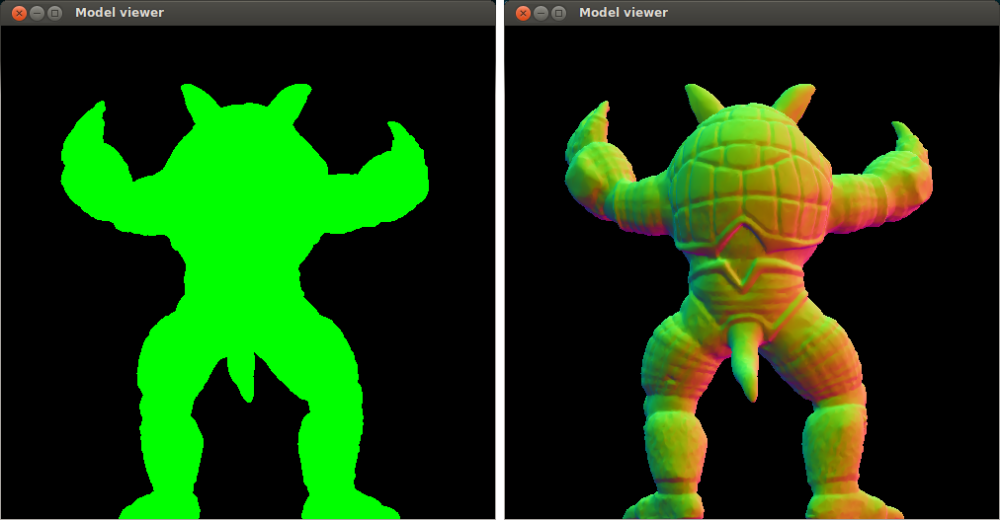
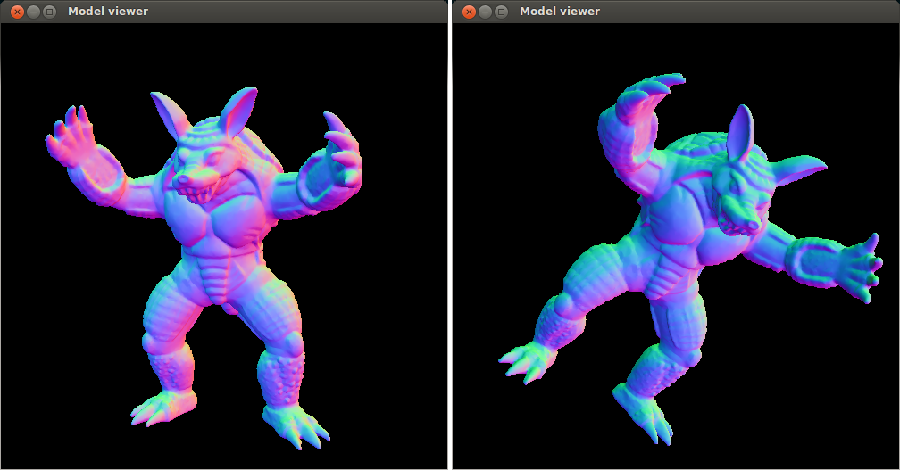
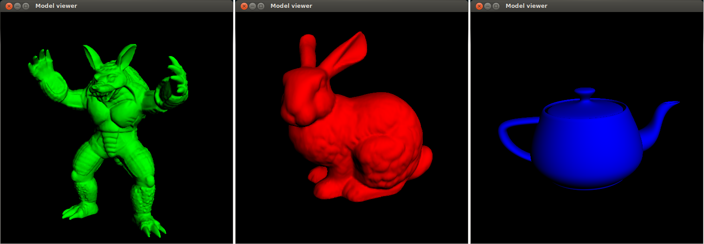
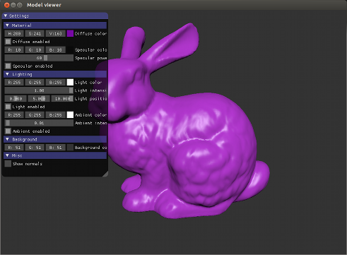
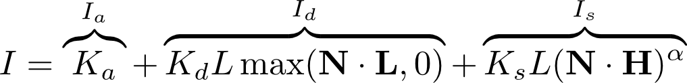

# Assignment 2 - Transforms, 3D viewing, and lighting (1TD388/1MD150)

In this assignment, you will continue to extend the glTF model viewer from https://github.com/cg-uu/gltf_viewer. The focus this time will be on setting up viewing, interaction, and basic lighting for the scene.

When writing GLSL shader code or using OpenGL to for example pass uniform variables to shaders, it can be useful to have this [quick reference](https://www.khronos.org/files/opengl-quick-reference-card.pdf) of the functions in the API. If you plan to use a newer OpenGL version than 3.3 (for example for the course project), there is an updated quick reference for OpenGL 4.5 available [here](https://www.khronos.org/files/opengl45-quick-reference-card.pdf). On the website http://docs.gl/, you can also find detailed documentation for e.g. the built-in GLSL functions.

The deadline for the assignment and further instructions about what parts and files you need hand in to pass are available on the course page in Studium.

## Part 1 - Surface normals and GUI

Starting from your code from part 4 of [Assignment 1](https://github.com/cg-uu/cg_assignment1), change the input filename in `model_viewer.cpp` from `"cube_rgb.gltf"` to `"armadillo.gltf"` (again, note that you can also provide this filename as argument via the command line). This will load a glTF scene of a 3D model that contains vertex normal data (but no vertex color data). If you run the program without modifying anything, the model will be loaded and displayed as a single-colored silhoutte.

Similar to how you enabled the attribute for vertex colors (`a_color`) in the previous assignment, add a new attribute `a_normal` (with correct location index!) to your shader `mesh.vert`. You can visualize the [surface normals](http://en.wikipedia.org/wiki/Normal_(geometry)) of the 3D model by (in `mesh.vert`) replacing

    v_color = a_color; 

with

    v_color = 0.5 * a_normal + 0.5; // maps the normal direction to an RGB color

This is also a good point to add a GUI to the program. The code already integrates the library [ImGui](https://github.com/ocornut/imgui), which you can use to create basic widgets like checkboxes, sliders, color edits, etc. When exposing a setting or parameter of the program to the GUI, you need to pass a pointer to a corresponding variable that is stored somewhere (for example in the `Context` struct). For instance, for a variable `ctx.myColor` of `type glm::vec3`, the code should look something like this:

    ImGui::ColorEdit3("My color", &ctx.myColor[0]);

A short introduction to ImGui is provided [here](https://github.com/ocornut/imgui). You find ImGui functions for other widgets in the file [imgui.h](https://github.com/ocornut/imgui/blob/master/imgui.h). There is also a [demo](https://github.com/ocornut/imgui/blob/master/imgui_demo.cpp) of widgets that you can try by uncommenting the following line in the `main()` function of `model_viewer.cpp`:

    // ImGui::ShowTestWindow();

After playing around a bit with ImGui, add a widget (and a new variable) for changing the background color via the GUI. We will continue to extend this GUI for later parts of the assignments as well.

 
## Part 2 - Transformations and 3D viewing

Let us move on to applying some transforms to the scene. In the previous assignment, you already set up a view matrix for basic interaction with a virtual trackball. As you noticed, the rotation appeared inverted, which was because we did not have a proper projection matrix.

In the `draw_scene()` function, create two new 4x4 matrices `projection` and `model` and pass them as uniform `mat4` variables to the vertex shader (like you did for the view matrix). Each matrix should initially be set to the identity matrix (`glm::mat4(1.0f)`).

In the vertex shader, concatenate (as you learned in the lecture about 3D viewing) the three matrices to a ModelViewProjection (MVP) matrix. As you should be aware of by now, matrix multiplication is non-commutative, so you need to check that you multiply the matrices in the correct order! The transform that you want to apply first should occur last and vice versa. Multiply the MVP matrix with the vertex position `a_position` in the vertex shader and assign the resulting transformed vertex position to `gl_Position`. After you have performed these steps the model should look the same as before (why?).

Try now to manipulate the model by applying different combinations of `glm::translate`, `glm::scale`, and `glm::rotate` on the model matrix. Also try to apply two transforms (e.g., a rotation and a translation) in different order and see how that affects the result. After this, look in the file `gltf_scene.h` to see how transform data is stored for each object (each `gltf::Node`) in the glTF scene. Your final model matrix should concatenate the translation, scaling, and rotation from this data.

Finally, use [`glm::lookAt`](http://glm.g-truc.net/0.9.5/api/a00176.html#ga454fdf3163c2779eeeeeb9d75907ce97) to set up a new view matrix and [`glm::perspective`](http://glm.g-truc.net/0.9.5/api/a00176.html#ga24983212d8d25b5b32e30d574dfccd1c) to set up a perspective projection matrix (these two matrices will define our virtual camera). Experiment with the different parameters. Your final view matrix should combine the matrix from `glm::lookAt` with the trackball matrix, so that the trackball rotation is applied first of the two transforms.

Note: nodes in glTF scenes can have children, and may also store a `mat4` matrix as transform instead of translation, scaling, and rotation data. However, at this step you can ignore this when computing your model matrices.

## Part 3 - Basic per-vertex lighting

We have not covered lighting and shading of the model yet, so in this part we will start by implementing a simple diffuse shading model known as the Lambertian reflectance model. Define and pass in two new uniforms to `mesh.vert`

    uniform vec3 u_diffuseColor; // The diffuse surface color of the model
    uniform vec3 u_lightPosition; // The position of your light source

The values of these uniforms should also be possible to change in the GUI, so that you can for example change the color of the model. Add the following lines in the shader's main() function:

    // Transform the vertex position to view space (eye coordinates)
    vec3 positionEye = vec3(mv * a_position);
    
    // Calculate the view-space normal
    vec3 N = normalize(mat3(mv) * a_normal);
    
    // Calculate the view-space light direction
    vec3 L = normalize(u_lightPosition - positionEye);
    
    // Calculate the diffuse (Lambertian) reflection term
    float diffuse = max(0.0, dot(N, L));
    
    // Multiply the diffuse reflection term with the base surface color
    v_color = diffuse * u_diffuseColor;

The fragment shader `mesh.frag` should just take `v_color` as input and assign it to `frag_color`. Because the color values from lighting will be interpolated over surfaces, this will produce the smooth shading effect shown in the images above. Try moving the light source around to see how it affects the shading, and also test with some other models from the `assets/gltf` folder.

Here we used the modelview matrix `mv` (which you have to compute in the shader from the `u_view` and `u_model` matrices you pass in) to transform `a_normal` to view-space. However, this only works as long as the modelview matrix does not contain any non-uniform scaling (as explained [here](http://www.lighthouse3d.com/tutorials/glsl-tutorial/the-normal-matrix/)). We will fix this in the next assignment, but you can ignore this problem for now.

## Part 4 - Blinn-Phong shading

The Phong and Blinn-Phong shading models are both introduced in the lectures in the course. Here, we will use the Blinn-Phong model, which uses the half-way vector H instead of the reflection vector R to calculate the specular component and is defined similarly as

In this model we have omitted the attenuation factor and use a single light color L (which is multiplied with the diffuse and specular terms) instead of three separate light colors La, Ld, and Ls. Note that we use bold L to denote the light vector and italic L to denote the light color!

Your tasks for this final part: 

- Define and pass the following material properties as uniform variables to the shader program: `u_ambientColor`, `u_diffuseColor`, `u_specularColor`, and `u_specularPower`.
- In `mesh.vert`, compute the ambient and specular terms of the Blinn-Phong shading model, and add them to `v_color` in addition to the Lambertian diffuse term you already computed in part 3.
- Add GUI components for tweaking the shading parameters. All the uniform variables listed above should be tweakable using sliders, color edits, checkboxes, etc.
- Add a checkbox for displaying the surface normals as RGB colors.
- Add a checkbox (or a combo box) for toggling between perspective and orthographic projection. Use [`glm::ortho`](http://glm.g-truc.net/0.9.5/api/a00176.html#gac393e9262776e4980731c386123e4377) to set up an additional orthographic projection matrix.
- Implement camera zoom so that the user can zoom in/out on the 3D model with the mouse scroll wheel. Hint: define a zoom factor variable that you use to modify the field-of-view (FOV) input parameter to `glm::perspective`, and update the factor from scroll events in the `scroll_callback()` function.

Done! In the next assignment, we will move our lighting calculations from the vertex shader to the fragment shader, and further tweak the Blinn-Phong shading model to make it normalized and more compatible with the [physically-based](https://github.com/moneimne/glTF-Tutorials/tree/master/PBR) materials used in glTF scenes. We will also add use of textures to improve the detail and lighting of the models!